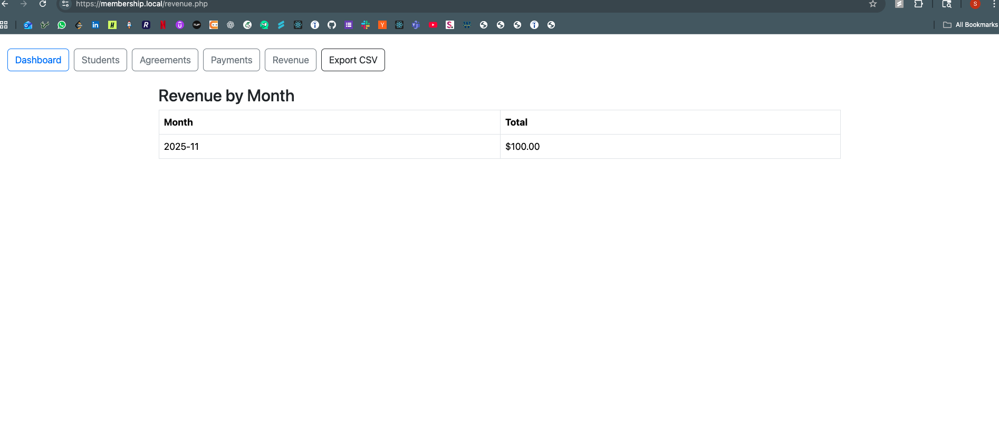

# 🥋  Membership Manager (LAMP Stack)

A lightweight **LAMP-based membership system** for managing **students, agreements, payments, and revenue** — inspired by platforms like [Atlas Martial Arts Software](https://atlasmartialartssoftware.com).

---

## 📸 Screenshots

### 🧑‍🎓 Students Management
Add and list student details with timestamps.  

### 📜 Agreements
Assign membership plans and track next due dates.  

### 💳 Payments
Record and view all payments with amount, method, and notes.  

### 📈 Revenue Dashboard
Summarize monthly income and export as CSV.  

---

## ⚙️ Tech Stack
- **L**inux – Local development environment (`membership.local`)  
- **A**pache – Web server  
- **M**ySQL – Stores students, plans, and payments  
- **P**HP – Backend CRUD logic  
- HTML, CSS, JS – Simple, responsive UI  

---

## 🔗 Features
✅ Student & Plan Management  
✅ Record Payments & Track Renewals  
✅ Monthly Revenue Report  
✅ CSV Export for backups or analytics  

